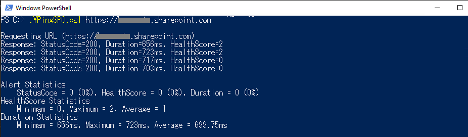

# PingSPO

This is a Ping PowerShell Script to acquire the health status of the SharePoint Online. 
HTTP Status Code, Duration (msec), SharePointHealthScore will be displayed.
And if there is any alert, you will see the Correlation ID as well.
With additional option (-AlertMe $true), you will be able to receive e-mail.

## Prerequisite

You need to download SharePoint Online Client Components SDK to run this script. 

https://www.microsoft.com/en-us/download/details.aspx?id=42038

## How To Run This Command

-SiteUrl ... [Required] The SiteURL to ping.

-Number ... Number of Ping Request (Default : 4)

-IntervalSecond ... The interval second of the ping request. Suggest you to set longer value, if you want to make large number of trials to ping by -Number option (Default : 1)

-ReturnPSObject ... Specify this switch if you want to retrieve the Summary of PingSPO data.

-AlertMe ... Specify this switch if you want to receive alert e-mail (Default : $false)

-ResetCred ... The credential will be stored on this script. Specify this switch if you want to reset the credential.

## Example 1

.\PingSPO.ps1 https://tenant.sharepoint.com

## Example 2

$summary = .\PingSPO.ps1 https://tenant.sharepoint.com -ReturnPSObject

## Example 3

.\PingSPO.ps1 https://tenant.sharepoint.com -AlertMe -Number 320 -IntervalSecond (60 * 15)

## Reference
Please also check the following Docs Script for the best practices.

https://docs.microsoft.com/en-us/office365/enterprise/diagnosing-performance-issues-with-sharepoint-online

